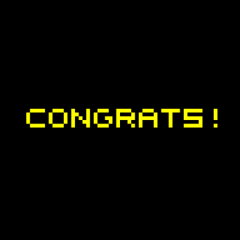
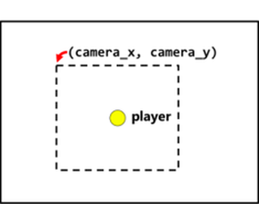

# Wonder Game (assembly)

By Anastasiia Rudenko 

*Date: 03/2022*

__Language__: MIPS Assembly

## Description

It's a __Wonder Game__ where a player can:
  * turn and move the character (north, south, east, west), 
  * use sword to kill moving blobs, 
  * place timed bombs to destroy obstacles,  
  * collect and use keys to open doors.

The **goal** of the game is to find and collect a **treasure**.

## Files 

  * `abc123_proj1.asm` contains all the main variables and functions.
  * `constants.asm` has the color and key constants for interacting with the display.
  * `macros.asm` contains some very useful macros, which are like custom pseudo-instructions.
    * Each macro has a comment documenting what it does. 
  * `display_2211_0822.asm` is a library of functions to interact with the display and keypad.
  * `game_constants.asm` contains constants specific to this game.
  * `map.asm` contains the game world map and related functions & arrays for loading and interacting with it.
  * `obj.asm` is a library of functions for creating and manipulating game objects.
  * `textures.asm` contains the graphics for the game.

## Game Overview

### The HUD

On top of the game field, you see the **HUD**, which shows some important information about the game:

  * The hearts ❤️❤️❤️ show how many times the **player can be hurt**.
    * This corresponds to the `player_health` variable.
  * The `Z` `X` `C` show the three actions the player can perform:
    * `Z` to slash the **sword**
    * `X` to place a **bomb**
    * `C` to use a **key on a door**
  * To the right of the key icon is a number showing **how many keys** the player has.
    * This corresponds to the `player_keys` variable.

### End of the game

If the player died, they see "**GAME OVER**" message.

If the player wins, they see "**CONGRATS!**" message.

        

### Camera 

The **camera** follows the player around, keeping them **in the middle of the screen**. But, if the player moves towards the edges of the playfield, the visible rectangle stays **within the boundaries of the playfield**, while the player can still move towards the boundaries.

        

### Movements

We can move our player as follows:
  * `up` arrow moves the player **north**
  * `right` arrow moves the player **east**
  * `down` arrow moves the player **south**
  * `left` arrow moves the player **west**

With a slight tap, the player will **turn to face the direction** we press. With a harder/longer press, the player **moves in that direction**.

### Keys and objects

The player cannot move through solid **objects**: bricks, rocks, bushes.

At the beginning of the game, the player is trapped in this starting room. The dark gray thing on the right side is a **locked door**. It’s solid, so the player can’t move through it. 

But it can be removed/unlocked with a **key**. A key object could be found in the top left corner of the room. To collect it, the player should step on it.

__Unlocking the door__

To escape the room, it is needed to be able to unlock the door. Once the player has a key, they should be able to **walk up to the door, face it, and press** `C`; this will **use a key** and **change the door into a grass**.

### The sword

The user **slash a sword** when they press `Z`. It appears in front of the player, in the direction they're facing. The sword can **destroy bushes** (by turning them into grass) and **destroy blob enemies** (by making them disappear).

*Note:* while the sword is out, the player cannot perform any other actions - no movement, no keys, no bombs.

### The bombs

**Bombs** are objects that can be placed in front of the player by pressing `X`. They work as follows:

  * The player places a single bomb with `X`. They cannot place another bomb for a short delay.
  * When a bomb is first placed, it just sits there, but its timer is counting down.
  * After a short time, it begins to flash, to indicate it is about to explode.
  * When it explodes, multiple things happen:
    * It can damage the **player, bushes, rocks, and blob enemies**. It does this on five tiles: the one it’s sitting on, and the four squares to the north/south/east/west direction of the place it’s sitting on (see picture below).
    * It **frees itself and disappears**.
    * It **creates five “explosion” objects** on those tiles, which are just a visual effect of the bomb explosion.

Bomb explosion:

It is okay to place bombs on top of walls, rocks, etc. That’s a *feature*, not a bug :)

### Blob enemies

So-called "Blobjects". They are the random-moving enemies. There are blobs in the bottom-left and bottom-right corners of the map, “guarding” the keys there. 

Blobs can **hurt a player**. If a player collides with a blob, the character loses one life.

Blob can be **defeated**: 
  * by a sword, 
  * by a bomb.

The player may also just try to **avoid the blob**. But move fast!

### Player's health

The player has **three lives** at the beginning: ❤️❤️❤️.

And, of course, the player can **get hurt**:
  * by a bomb
  * by a blob

When the player gets hurt, **the hearts at the top left decrease from 3 ❤️❤️❤️ to 2 ❤️❤️.** We can keep decreasing the player's health this way, but we will always see at least 1 heart. Once a player loses the last "health point", the game shows the "**GAME OVER**" message.

### Invincibility

If the player got hurt, they start blinking. 

To show the player that they got hurt, and to give them a little break so they don’t get hurt *over and over*, the game use **invincibility (or invulnerability) frames**. Basically, when a player gets hurt, they *temporarily* become invincible - they cannot be hurt for the next several frames of game time. 

Once the player is no longer invincible, they stop blinking.

### Treasure

The **goal** of the game is to collect the **treasure**. It’s a shiny yellow triangle. Touching the treasure ends the game and congratulates the player. On the game map, it’s located in the top right corner, behind two locked doors.

## How the game works (implementation)

### Game world

The game world is a big 2D grid of tiles. Like a checkerboard or chessboard. Each “thing” or “**object**” in the game world occupies one tile. The player can walk on some tiles (grass, flowers, sand) but can’t pass through others (bricks, rocks, bushes).

The world is created too big to show all at once on-screen. So, we only show a small portion of it.

The constants in the diagram above (`SCREEN_TILE_W` etc.) are defined in `game_constants.asm`. These define the dimensions of the world as a whole, and the small rectangle of the world that we show on the display.

### The playfield

The **playfield** is the “background” of the world, where all the grass and bushes and walls are. It is the `playfield` array defined around line 50 of your program. The first thing `main` does is callling `load_map`, which fills in this array based on map data I’ve given you in `map.asm`. That way, we can separate a game programmer AND a game designer

Each item of the `playfield` array holds one of the `TILE_` constants defined in `game_constants.asm`. The names should be pretty obvious: `TILE_BRICK` is a brick wall; `TILE_GRASS` is grass; etc.

### Game world graphics

The graphics are made in the style of old 8- and 16-bit video game consoles. It has a so-called “blocky” grid-like appearance.

The `world_map` array can be found at the top of `map.asm`. 
  * the `#` represents a brick wall, 
  * the `r` represents a rock, 
  * the `f` represents flowers, 
  * the `b` represents bushes,
  * etc...

The graphics for all these things are coming from `textures.asm`, in the `tile_textures` array. That’s another array-of-arrays that points to the graphics for each tile.

### Player movements

We can ask the map if a tile is solid (can’t pass through) or not with the `is_solid_tile` function. It takes the tile coordinates as arguments, and returns a “boolean” (just a 1 or 0); 1 means it’s solid and they can’t walk on it, and 0 means it’s walkable.

__The player's movement speed__

The game runs at 60 frames per second. That means the main loop runs 60 times per second, once every 16.6666… milliseconds. Inside the program, the game character is allowed to take a step once every certain number of frames. 

The `player_move_timer` variable represents if the player can move (=0), or can't (!=0).

  * every time the player takes a step, it is set to a constant, `PLAYER_MOVE_DELAY` (from `game_constants.asm`).
  * every frame, if this variable is > 0, it is decremented.
  * then, the next time the player tries to take a step, if this variable is not 0, we won’t let them move.

So, it only lets the player take one step in every `PLAYER_MOVE_DELAY` frames.

### Weapons

__Sword__

When the user presses `Z`, the **sword** appears in front of the player, drawn with appropriate graphics based on `player_dir`. It will stay out for `PLAYER_SWORD_FRAMES` frames, then disappear. This is controlled by `player_sword_timer`.

__Bomb__

When the user presses `X`, the **bomb** appears in front of the player, drawn with appropriate graphics based on `player_dir`. A new bomb cannot be placed for a short delay. This is controlled by `player_bomb_timer`. 
The `object_timer` field of the bombs counts down as long as they are active. When the timer reaches 0, they need to explode. This is the job of `obj_update_bomb`. 
`obj_draw_explosion` should draw `tex_explosion`, in the same way as `obj_draw_key` does it.
`obj_update_explosion` should `obj_free` the explosion if its `obj_timer` is 0.

### Hurting the player and iframes

The `hurt_player` function is responsible for decrementing the `player_health`.
The way the `draw_hud` function works, it will always show at least 1 heart. 

The player's invincibility is controlled by the `player_iframes` variable.
`frame_counter` is a global variable from `display_2211_0822.asm`. It counts how many frames have elapsed since the game started. We always work when the `frame_counter` is divisible by 8.

